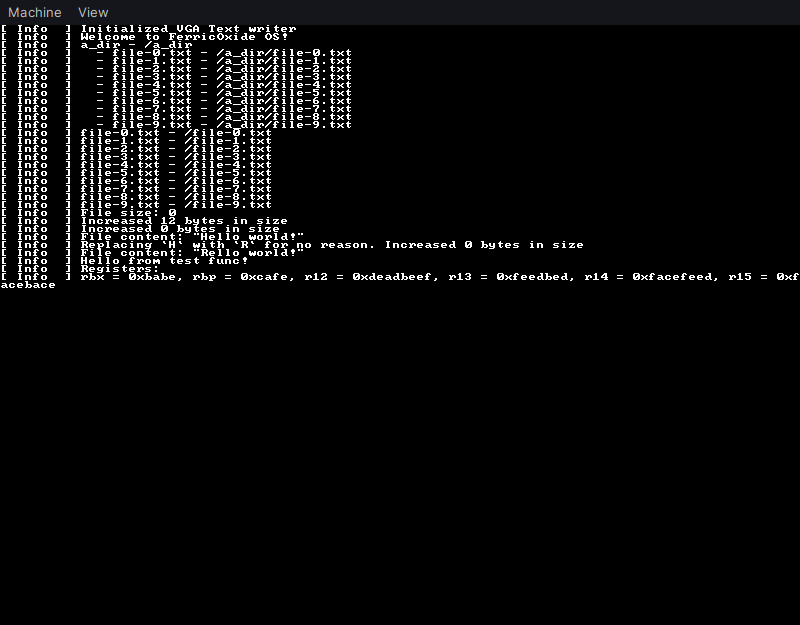

+++
title = "Taking the first step towards adding multitasking in my Kernel"
description = "I've decided I want to add multitasking in my kernel after doing some preliminary work on VFS and RAMFS. How hard is it going to be?"
date = "2023-01-25T15:14:04.235Z"
+++

Hi there! I've been working on my own [operating system](https://github.com/mdgaziur/ferricoxide-os) since last year.
It currently has paging, virtual file system, ramfs, and it can show stuff by writing pixels into a framebuffer. I've
always been curious with how Linux, Windows and other operating systems do multitasking. More importantly, how do they switch
context?

## Trying to learn from OSDev Wiki
In the [OSDev Wiki](https://wiki.osdev.org), I found a pretty interesting tutorial on multitasking. It can be found
[here](https://wiki.osdev.org/Brendan%27s_Multi-tasking_Tutorial). I tried to read through it and understand what's
going on. But, alas! I couldn't understand even 50% of it. I was pretty confused about the implementation of `switch_to_task`.
But tbh, it was not the OP's fault. The most interesting thing was `Thread Control Block`. If we look at the code:

```asm,linenos
;C declaration:
;   void switch_to_task(thread_control_block *next_thread);
;
;WARNING: Caller is expected to disable IRQs before calling, and enable IRQs again after function returns
 
switch_to_task:
 
    ;Save previous task's state
 
    ;Notes:
    ;  For cdecl; EAX, ECX, and EDX are already saved by the caller and don't need to be saved again
    ;  EIP is already saved on the stack by the caller's "CALL" instruction
    ;  The task isn't able to change CR3 so it doesn't need to be saved
    ;  Segment registers are constants (while running kernel code) so they don't need to be saved
 
    push ebx
    push esi
    push edi
    push ebp
 
    mov edi,[current_task_TCB]    ;edi = address of the previous task's "thread control block"
    mov [edi+TCB.ESP],esp         ;Save ESP for previous task's kernel stack in the thread's TCB
 
    ;Load next task's state
 
    mov esi,[esp+(4+1)*4]         ;esi = address of the next task's "thread control block" (parameter passed on stack)
    mov [current_task_TCB],esi    ;Current task's TCB is the next task TCB
 
    mov esp,[esi+TCB.ESP]         ;Load ESP for next task's kernel stack from the thread's TCB
    mov eax,[esi+TCB.CR3]         ;eax = address of page directory for next task
    mov ebx,[esi+TCB.ESP0]        ;ebx = address for the top of the next task's kernel stack
    mov [TSS.ESP0],ebx            ;Adjust the ESP0 field in the TSS (used by CPU for for CPL=3 -> CPL=0 privilege level changes)
    mov ecx,cr3                   ;ecx = previous task's virtual address space
 
    cmp eax,ecx                   ;Does the virtual address space need to being changed?
    je .doneVAS                   ; no, virtual address space is the same, so don't reload it and cause TLB flushes
    mov cr3,eax                   ; yes, load the next task's virtual address space
.doneVAS:
 
    pop ebp
    pop edi
    pop esi
    pop ebx
 
    ret                           ;Load next task's EIP from its kernel stack
```

It seems to store some registers, and then loads the TCB of previous task into `edi`. And then loads
the TCB of next task to esp. And then does some `mov`'s I don't really understand. There are some stuff like
`kernel stack` and `virtual address space` that aren't really present in the kernel right now. So, I decided to change
my plan.

## Plan B

I started to go through random repositories of fantastic kernels written by fantastic people to try to grasp how
they did multitasking. I looked through source code of [Lemon OS](https://lemonos.org), [Aero OS](https://aero.andypy.dev/aero_kernel/index.html)
and many more. One thing they had in common is that the scheduler would do some stuff and then pass the context information
to an assembly function. That thing does the actual work of moving and updating all the necessary registers and doing the
jump.

But, what about `rip`? This was a pretty stupid thing done by me tbh. I was trying to find how to update `rip` directly.
Like, `mov rip, rax`. I didn't realize that it was impossible. It was possible to read value by using `lea`.
So, I wasted couple weeks thinking about it. Yeah. But then, today I just found I can do it just by pushing a value
onto stack and running `ret`. Damn. This easy?

So now I started to implement a basic function that'll take a struct `Context` and use the values from there
to update the registers.

```rs,linenos
#[derive(Default, Debug, Copy, Clone)]
#[repr(packed)]
pub struct Context {
    pub rbx: u64,
    pub rbp: u64,
    pub r12: u64,
    pub r13: u64,
    pub r14: u64,
    pub r15: u64,
}
```

Following is the code of the function:

```rs,linenos
#[naked]
pub unsafe extern "C" fn switch_context(
    new_context: &Context,
    new_cr3: usize,
    rip: usize,
) {
    asm!(
        "\
        mov rax, rsp
        mov rsp, rdi
        pop rbx
        pop rbp
        pop r12
        pop r13
        pop r14
        pop r15
        mov rsp, rax
        mov cr3, rsi
        push rdx
        ret
    ",
        options(noreturn)
    )
}
```

This is a naked function(doesn't have the prologue and epilogue like normal functions do) that takes the context,
cr3(for setting the address space of switched task) and the value for `rip`. The code basically backs up the stack first,
then sets the pointer to `Context` as stack pointer. Then we pop the values from it with the same order we declared
the register values in `Context`. The ordering is very important here. Otherwise, register will get wrong value. Then
it restores original stack, updates cr3. After that, it basically pushes `rdx`. Why `rdx`? Well, the "C" calling convention
requires that function arguments are put in following order: `rdi`, `rsi`, `rdx`, `rcx`, etc. That means, `new_context`
is stored in `rdi`, `new_cr3` is stored `rsi` and `rip` is stored in `rdx`. After that, we run the `ret` instruction.

## Testing the thing

Let's make a dummy function and call it through this. First, the dummy function:

```rs,linenos
fn test_func() {
    let rbx: u64;
    let rbp: u64;
    let r12: u64;
    let r13: u64;
    let r14: u64;
    let r15: u64;
    let xmm0: *const u64;

    unsafe {
        asm!("\
            mov {}, rbx\n\
            mov {}, rbp\n\
            mov {}, r12\n\
            mov {}, r13\n\
            mov {}, r14\n\
            mov {}, r15\n\
        ", out(reg) rbx,
            out(reg) rbp,
            out(reg) r12,
            out(reg) r13,
            out(reg) r14,
            out(reg) r15);
    }

    info!("Hello from test func!");
    info!("Registers: ");
    info!("rbx = 0x{:x}, rbp = 0x{:x}, r12 = 0x{:x}, r13 = 0x{:x}, r14 = 0x{:x}, r15 = 0x{:x}",
        rbx, rbp, r12, r13, r14, r15);
}
```

The function basically reads all the registers updated by the context switch function and displays the values.
Let's call `switch_context` with some values:

```rs,linenos
unsafe {
    switch_context(
        &Context {
            rbp: 0xcafe,
            rbx: 0xbabe,
            r12: 0xdeadbeef,
            r13: 0xfeedbed,
            r14: 0xfacefeed,
            r15: 0xfacebace,
        },
        Cr3::read().0.start_address().as_u64() as usize,
        test_func as *const fn() as usize,
    );
}
```

We are basically setting some interesting values to the registers, setting cr3 to what we are using currently as we can't
set up new page tables now, and then passing the pointer to `test_func`. The `switch_context` function doesn't crash and switches
task successfully. Here's the output:



## Conclusion

I've learned some stuff about switching context and tried to implement them. Tbh, current one isn't really efficient.
It doesn't really store the context of previous task somewhere, and it's currently a fancy unsafe function caller. 
I've plans to make it so that it actually works properly in real multitasking scenario. I'm going to have to write a 
scheduler and make it schedule tasks. It can be done through `PIC`. But that's for next time. Currently, my college
class is going to begin soon, and I'm going to have to study to get into a good university. Till then, stay safe and keep grinding.